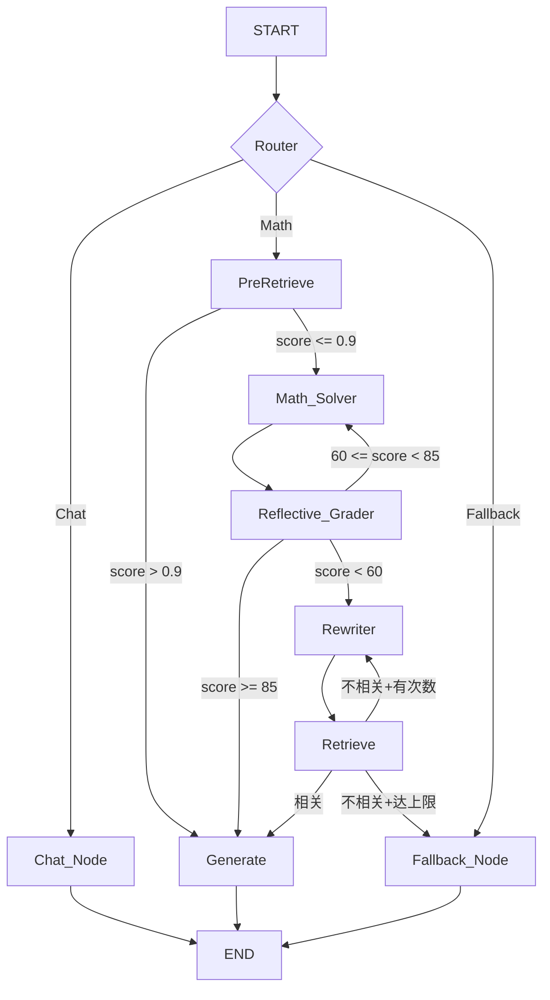

# MathRAG-System: 语义感知的数学 Agentic RAG 系统


## 📌 项目背景
在数学教材（如《高等代数》）场景下，传统 RAG 存在两大核心瓶颈：
1. **OCR 鲁棒性差**：跨页公式断裂、LaTeX 语法失衡导致索引质量极低。
2. **逻辑链条破碎**：固定长度切分会切断“定理-证明”或“题目-详解”的完整语义，导致生成答案逻辑断裂。

本项目核心假设：通过精细化的RAG架构设计，轻量模型（1.7B级）可在复杂推理任务中达到甚至超越裸大模型的效果。

**成果：** 本项目通过 **Agentic RAG (v2.2+)** 架构，实现了从“知识检索”到“自适应逻辑推理”的跨越，显著提升了复杂数学问题的解决能力。
> 本项目为个人独立开发，覆盖数据清洗、语义切分、检索优化、Agent编排与量化评测全链路。
---
## 🎯 适合谁看？
- 想了解Agentic RAG工程化实践的开发者
- 数学/教育领域RAG落地的研究者
- 招聘方：本项目为个人独立开发，全链路自主设计实现，详见源码（src/）、技术文档（doc/）与评测体系（test/）。
---

## ✨ 核心特性

### 1. 自适应 Agent 调度 (Adaptive Agentic Flow)
基于 **LangGraph** 构建有向无环图 (DAG)，打破“检索-生成”的直线逻辑，引入三层分流：
- **Fast-Track**：意图识别判定简单问题/闲聊，无需检索直接响应，降低延迟。
- **Self-Refine**：内置 `Reflective Grader` 评分节点，对生成草稿进行逻辑自检，不达标自动触发检索。
- **RAG-Track**：针对复杂证明，启动多路检索与逻辑块聚合。

### 2. 公式自动化修复 (Formula Fixer)
- **局部重写技术**：利用 `[TARGET]` 锚点定位损坏公式，结合 Few-shot 仅修复 LaTeX 环境，避免对非数学文本的误伤。
- **物理验证**：集成 PyLaTeX 渲染校验，确保索引入库的每一个公式均可编译。

### 3. 语义感知切分与聚合 (Logic-aware Strategy)
- **结构路径注入**：在每一个 Chunk 头部自动补全章节路径（如 `[第7章 > 7.1 > 定理]`），强化空间特征。
- **三级语义切分**: L1根据“定义/定理/证明/…”切分，L2根据逻辑衔接词如“由于/因此/…”，L3根据符号切分。
- **Block ID 关联**：基于数学逻辑边界（定义/定理/证明）分配 Block ID，在检索时实现“前向引理+后向推论”的动态上下文扩展。

---

## 🏗️ 系统架构
为了保证 README 的简洁性，详细的 **双轨检索流程图** 请参阅doc/rag_report.md：


---

## 📊 实验表现

- **测试基准**：基于《高等代数》标准教材构建的 85 条 QA 测试集（包含60条常规题与25条长证明压力测试）。

- **测试模型**：Qwen3-1.7B（本地llama.cpp部署）。
- **设计意图**：验证"轻量模型+优质框架"能否突破其原生能力边界。常规题对比已完成，长证明压力测试中Block聚合机制有效（correctness 0.48→0.77）。

- **名称说明**：MathRAG 指"结构注入 + 三级语义切分"
- **系统说明**：Agent 效能对比中，RAG-only 与 v2.3 均基于 MathRAG + BlockGet 构建


### 1. 检索性能对比 (Retrieval Quality)
| 方案版本 | MAP | MRR | Recall | 备注 |
| :--- | :---: | :---: | :---: | :--- |
| Baseline (Hybrid) | 0.4641 | 0.6222 | 0.5236 | 固定长度切分 |
| **MathRAG (v2.3)** | **0.6125** | **0.7083** | **0.7194** | **Block 聚合 + 结构注入** |

>注：这里的MAP，MRR，Recall是召回top-20后，rerank得到top-3计算出来的

### 2. RAG 系统效能
> 注：以下数据在长证明中测得：
> 注：这里系统指的是：Qwen3-1.7B+RAG数据库，采用经典的“检索-召回-重排-生成”

| 系统 | correctness<br>avg ≥1% | faithfulness<br>avg ≥1% | answer_relevance<br> | context_relevance |
|:---|:---|:---|:---|:---
| Baseline (Hybrid) | 0.44 10.5% | 0.52 9.5% | 1.73 | 1.31 |
| MathRAG(语义切分，无 Block 聚合) | 0.48 11.5% | 0.65 10% | 1.83 | 1.48 |
| **MathRAG + BlockGet** | **0.77** **13%** | **1.00** **14.5%** | **1.75** | **1.46** |

### 3. Agent 系统效能 (Generation & Cost)
> 注：以下数据是在常规测试集中测得

| 版本 | 正确性 (Avg) | 忠诚度 (Faith) | 上下文相关度 |备注 |
| :--- | :---: | :---: | :---: | :---: |
| Origin |  1.22/2.0   | -| - | 直接使用模型进行回答 |
| RAG-only | 1.63/2.0 | 1.49/2.0 | 1.85/2.0 |- | 
| **v2.3 (RAG路径)** | **1.64/2.0** | **1.61/2.0** | 1.92/2.0 |  Agent架构+RAG，含PreRetrieve

**效果：** v2.3 RAG路径correctness与RAG-only持平，但faithfulness（1.61 vs 1.49）与context_relevance（1.92 vs 1.85）均有提升，Agent闭环（Grader评分+上下文聚合）有效提升了生成质量与稳定性。

>注：v2.3 新增 PreRetrieve 节点后，原 Fast-Track 部分问题被高置信检索拦截，转入 RAG 直接生成，故 RAG 路径占比从 v2.2 的 42% 上升至 76%; 在v2.3中，常规测试集的RAG路径都是走PreRetrieve

>注：长证明压力测试（24条）：Origin 异常率 16.67%（4/24），RAG 异常率 4.17%（1/24），Agent 异常率 4.17%（1/24）。框架显著提升了生成稳定性。
---

## 🛠️ 快速开始

### 1. 部署向量数据库
```bash
docker run -d -p 6333:6333 -p 6334:6334 -v "${PWD}/qdrant_storage:/qdrant/storage:z" --name MathRAG qdrant/qdrant
```

### 2. 环境安装与配置
```bash
pip install -r requirements_agent.txt
# 在 .env 中配置 API_KEY (支持 Qwen, GLM-4, DeepSeek)
```

### 3. llama.cpp或者vllm部署
```bash
# 使用llama.cpp
docker run -d \
  --name llama-server \
  -p 8080:8080 \
  -v {GGUF_model_path}:/models \
  ghcr.io/ggml-org/llama.cpp:server-cuda \
  -m /models/{model_name} \
  --port 8080 \
  --host 0.0.0.0 \
  -n 4096 \
  -ngl 99 \
  -c 16384
# port:指定服务监听的端口; n:控制生成的最大 token 数量; ngl:将模型的前 99 层加载到 GPU 显存; c:设置上下文长度
```

```bash
# 使用vllm(推荐在Linux上运行)
pip install vllm

python -m vllm.entrypoints.openai.api_server \
  --model {model_path} \
  --host 0.0.0.0 \
  --port 8000 \
  --served-model-name {model_name} \
  --max-model-len 32768 \
  --max-num-seqs 3 \
  --gpu-memory-utilization 0.8 \
  --dtype bfloat16
```

### 4. 运行 Agent
```bash
python example_agent.py --query "如何证明实对称矩阵必可对角化？"
```

---

## 📂 项目结构
```
Math_RAG_System
├─ .env                                 # 存放 API_KEY（Qwen, GLM4, DeepSeek）
├─ download.py                          # 用来下载模型
├─ example_agent.py                     # agent入口
├─ LICENSE
├─ RAG_main.py                          # RAG入口
├─ README.md
├─ requirements.txt
├─ requirements_agent.txt
├─ model/                               # 存放模型
├─ test                                 # 用于测试
│  ├─ agentTest.py
│  ├─ summary.py
│  ├─ test.py
│  ├─ testset                           # 测试集
│  │  ├─ longTest.json
│  │  └─ Test.json
│  └─ result
│     ├─ RAG
│     │   ├─ Long_Test.json
│     │   ├─ Test_Result2.json
│     ├─ v2.2
│     │   ├─ longTest_agent_eval.json
│     │   └─ Test_agent_eval.json
│     └─ v2.3
│         ├─ longTest_agent_eval.json
│         └─ Test_agent_eval.json
├─ src                                  # 源码
│  ├─ __init__.py
│  ├─ utils
│  │  ├─ config_loader.py               # 统一读取 yaml 配置文件
│  │  ├─ insertQdrant.py                # 用来插入数据库 
│  │  └─ __init__.py
│  ├─ rag                               # RAG源码
│  │  ├─ __init__.py
│  │  ├─ retriever
│  │  │  ├─ context_builder.py          # 用来执行block聚合：召回-重排-block聚合
│  │  │  ├─ reranker.py                 # 用来执行重排
│  │  │  ├─ searcher.py                 # 用来召回
│  │  │  └─ __init__.py
│  │  ├─ parser
│  │  │  ├─ formula_fixer.py            # 核心：正则扫描 + LLM 局部重写 + PyLaTeX 校验
│  │  │  └─ __init__.py
│  │  ├─ generator
│  │  │  ├─ generate.py                 # Qwen3 调用逻辑
│  │  │  └─ __init__.py
│  │  └─ chunked
│  │     ├─ chunk.py
│  │     └─ __init__.py
│  ├─ pipeline
│  │  ├─ chat_pipeline.py
│  │  ├─ ingest_pipeline.py
│  │  ├─ retriever.py
│  │  └─ __init__.py
│  ├─ evaluation                        # 用于测试，分别为RAG测试，agent测试
│  │  ├─ agent_evaluator.py
│  │  ├─ evaluator.py
│  │  ├─ score.py
│  │  └─ __init__.py
│  └─ agent                             # agent源码
│     ├─ graph.py                       # agent节点流动
│     ├─ state.py                       # agent状态定义
│     ├─ __init__.py
│     └─ nodes                          # agent节点
│        ├─ grader.py
│        ├─ math_solver.py
│        ├─ rewriter.py
│        ├─ router.py
│        └─ __init__.py
├─ doc
│  ├─ agent_report.md
│  └─ report.md
├─ Data
│  ├─ raw                                # 原始文件,这里为了简便，不提供原始教材
│  │  └─ full.md
│  └─ processed                          # 处理后的文件
│     ├─ baseline_chunks.json
│     ├─ fixed.md
│     └─ math_chunks.json
└─ configs                               # 模板在这
   ├─ config.yaml
   └─ fewShot.yaml                       # LLM局部重写所使用的
```

---

## 🧠 设计决策与技术问题

### 1. 为什么不用定长切分？
数学教材中"定理-证明"跨越多个自然段，定长切分会切断逻辑链。采用**三级分层切分**：
- **L1规则**：关键词触发（定理/命题/证明/例/解）
- **L2语义**：逻辑衔接词（因此/综上…）+ 动态overlap
- **L3兜底**：符号级切分（。；）保证长度约束

### 2. 为什么选Qwen3-1.7B？
项目核心假设是"框架增益 > 模型规模"。1.7B模型原生能力有限，若框架能使其在复杂推理任务中达到可用水平，则证明架构设计的有效性。**具体做法**：本地llama.cpp部署，CPU/GPU混合调度适配8GB显存约束。后续将在32B等模型上验证扩展性。

### 3. 测试集只有85条，如何保证说服力？
85条为压力测试集，聚焦跨页长证明、公式密集查询等hard case。常规case已通过人工抽检覆盖。

### 4. 为什么不存在QPS等延迟数据？
本项目聚焦算法架构验证，本地llama.cpp部署的绝对延迟受硬件约束（RTX 4060 8GB），无横向对比价值。并发、延迟等压力测试将在后续展开。

### 5. 当前已知局限与后续优化
- **切分逻辑**：L2/L3当前基于规则，正在调研LLM-based上下文感知切分
- **索引关联**：定理-证明当前为单向索引，计划实现双向关联索引

---
## 🚀 Roadmap
- [x] ~~**Pre-Retrieval Probe (v2.3)**：引入前置低成本探针，针对高置信度命中（原文提取）实现极速截断。~~
- [ ] **Small-Model Distillation**：针对 1.7B 模型在长逻辑场景下的“幻觉自信”进行微调优化。
- [ ] **LLM-based Context-Aware Chunking**：针对当前基于规则的三段切分（L2/L3）局限性，调研并实现基于大模型的上下文感知切分逻辑。
- [ ] **Multi-Modal Support**：支持教材插图与矩阵图像的语义解析。
- [ ] **Theorem-Proof Bidirectional Index**：block级的“定理-证明”双向索引添加
- [ ] **Cross-Scale Validation**：在Qwen3-32B等多参数量模型上验证框架扩展性，建立1.7B→32B的能力增益曲线。
---

## 更新日志：

v2.2 → v2.3
- 新增 PreRetrieve 快速预检节点（graph.py）—— 路由判定为 Math 后，先用原始问题快速检索 + Rerank 打分：
- 新增 pre_retrieve_threshold 配置项（config.yaml），默认 0.9
- 完整 v2.3 版本发布，包含 Agent 系统效能评测
- **效果**：v2.3 RAG路径correctness达1.64，较RAG-only(1.63)持平，但长证明异常输出率从16.67%(Baseline)降至4.17%(v2.3)；PreRetrieve分流使RAG路径占比从42%升至76%，Fallback率从6.7%（v2.2）降至0%。

v2.1 → v2.2
- 实现了更好的 Agent 架构：引入 LangGraph 编排的 Agentic RAG 系统
- 新增路由节点（RAG/Chat 分流）、查询重写、文档相关性评分等 Agent 节点
- 针对小模型的优化：结构化 JSON 输出、循环限制、Fallback 机制

v2.0 → v2.1
- 分布式检索：检索节点从单查询改为多关键词分组检索 → 各自 rerank + block 聚合 → 候选池二次重排精选
- 查询重写升级：输出从单字符串改为关键词数组（最多 4 组），"锚点优先"原则，LaTeX 转义修复的 JSON 解析
- 新增 keyword_groups AgentState 字段
- 新增 rerank_texts 方法：支持纯文本列表重排

v1.0 → v2.0
- 新增 math_solver.py — 数学求解节点，增强 Agent 的数学推理能力
- 重写 graph.py — LangGraph 编排逻辑大幅重构
- 重写 grader/rewriter/router — 各节点逻辑优化
- state.py 扩展 — AgentState 增加新字段

v1.0
- 从零搭建了完整的 RAG pipeline
---
## ⚖️ 免责声明 / Disclaimer

**项目用途**：本项目为个人实习作品，完全由个人独立开发，欢迎技术交流与合作机会。

**版权说明**：本项目为个人学习及实习作品。涉及的部分原始教材资料来源于公开网络，仅做算法验证使用。若相关版权方认为本项目内容存在侵权，请通过 GitHub 联系作者删除。

**数据用途**：本项目提供的代码及实验数据仅供学术交流，严禁用于任何商业用途。

**准确性声明**：受限于 OCR 技术、大模型幻觉及 RAG 逻辑，答案可能存在错误。作者不承担因使用本项目内容产生的任何直接或间接损失。

**开源协议**：本项目代码遵循 MIT 协议开源。