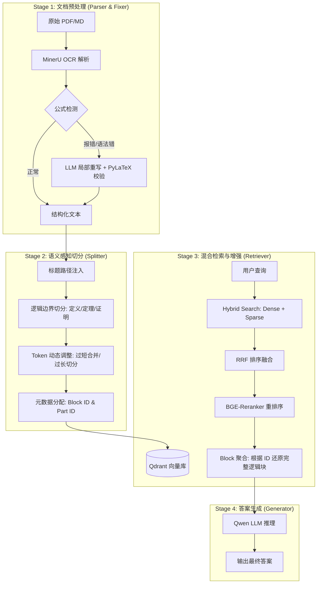

# MathRAG-Algebra: 高等代数语义感知的 RAG 系统


## 📌 项目背景
传统的 RAG 系统在处理数学教材时存在两大痛点：
1. **OCR 质量受限**：公式符号错乱、括号失衡、跨页公式断裂。
2. **语义块破碎**：传统的固定长度切分会切断长证明（Proof）和解题步骤（Solution），导致生成结果逻辑断裂。

本项目针对**高等代数**教材进行了彻底重构，通过**逻辑断点切分**与**公式局部修复**技术，显著提升了数学场景下的检索准确率与生成质量。

---

## ✨ 核心特性

### 1. 公式自动化修复 (Formula Fixer)
- **发现机制**：基于严格正则规则与 PyLaTeX 渲染校验，自动识别异常公式块。
- **局部重写策略**：利用 LLM 仅对 `[TARGET]` 区域进行修复，在纠正 LaTeX 语法的同时最大限度保留非数学原文，避免无效 Token 干扰。

### 2. 语义感知切分 (Logic-aware Chunking)
- **逻辑断点识别**：按 `定义|定理|证明|命题` 等数学关键词边界切分。
- **结构路径注入**：每个 Chunk 头部自动补全章节路径（如 `[第7章 > 7.1 > 定义]`），强化检索时的环境特征。
- **Block 聚合逻辑**：通过 `block_id` 关联长证明的不同片段，确保在生成阶段能够召回完整的逻辑链条。

### 3. 高性能检索 Pipeline
- **混合检索**：结合 BGE-M3 的稠密 (Dense) 与稀疏 (Sparse) 向量，通过 RRF 算法融合。
- **精细重排**：使用 BGE-Reranker-V2-M3 进行 Top-K 过滤，严格控制上下文窗口。


---

## 📊 实验表现

> **说明**：以下指标基于测试集 A（单点/对比问答）与测试集 B（长证明压力测试）测得。

### 检索性能对比
| 系统版本 | MAP@20 | MRR@20 | Recall@20 |
| :--- | :---: | :---: | :---: |
| Baseline (Dense) | 0.4358 | 0.5365 | 0.7178 |
| Baseline (Hybrid) | 0.3677 | 0.4916 | 0.6428 |
| **MathRAG (Ours)** | **0.6125** | **0.7083** | **0.7194** |

### 生成质量 (LLM-Judgement)
使用 GPT-4o 级模型（GLM-4 / DeepSeek）对正确性、忠诚度等四个维度进行 0-2 分盲测：
- **MathRAG 方案在“忠诚度 (Faithfulness)”维度提升显著（+15%）**，主要归功于公式修复与完整 Block 召回。

---

## 🛠️ 快速开始

### 1. 环境准备
```bash
# 克隆仓库
git clone https://github.com/ycjcx123/Math_RAG_System
cd MathRAG

# 部署向量数据库
docker run -d -p 6333:6333 -p 6334:6334 -v "${PWD}/qdrant_storage:/qdrant/storage:z" --name MathRAG qdrant/qdrant
```


--------------------------
关于部署的问题

暂时仅支持本地Qdrant数据库，建议使用docker部署
关于Qdrant数据库，建议执行：docker run -d -p 6333:6333 -p 6334:6334 -v "${PWD}/qdrant_storage:/qdrant/storage:z" --name MathRAG qdrant/qdrant

关于config内的参数:
    请仔细阅读configs/config.yaml中的注释
    尤其是api，如果使用.env文件的话，请自行对齐
    如果不打算使用.env文件的话，请直接在config中更换api_key;

关于测试：
    目前仅支持使用llm-judgement，仅支持glm和deepseek（OpenAi格式）的api；虽然deepseek使用的是OpenAi格式，但是字段可能需要自行配置
    注：下述指标基于重构前的核心逻辑版本（v0.1）测得。目前 v1.0 重构版已跑通全流程 Pipeline，由于 LLM-Judgement 运行成本及时间限制，全量测试集的新版本指标正在更新中，但核心性能趋势具有一致性。

关于模型：
    注意：Qwen3-1.7B 性能可能受限，推荐使用 Qwen2.5-7B/14B 或 DeepSeek-V3 以获得最佳生成体验。

```
Math_RAG_System
├─ .env                         # 存放 API_KEY（Qwen, GLM4, DeepSeek）
├─ download.py                  # 用来下载模型
├─ LICENSE
├─ main.py                      # 全局入口
├─ README.md
├─ model/                       # 用来存放模型
├─ test                         # 测试位置
│  ├─ longTest.json
│  ├─ Test.json
│  ├─ test.py                   # 测试代码
│  └─ result                    # 测试结果存放位置
│     ├─ Long_Test.json
│     └─ Test_Result2.json
├─ src                          # 源码
│  ├─ __init__.py
│  ├─ utils
│  │  ├─ config_loader.py       # 统一读取 yaml 配置文件
│  │  ├─ insertQdrant.py        # 用来插入数据库 
│  │  └─ __init__.py
│  ├─ retriever
│  │  ├─ context_builder.py     # 用来执行block聚合：召回-重排-block聚合
│  │  ├─ reranker.py            # 用来执行重排
│  │  ├─ searcher.py            # 用来召回
│  │  └─ __init__.py
│  ├─ pipeline
│  │  ├─ chat_pipeline.py       # 对话流水线：Searcher -> Reranker -> ContextBuilder -> LLM
│  │  ├─ ingest_pipeline.py     # 入库流水线：Parser -> Fixer -> Splitter -> Qdrant
│  │  └─ __init__.py
│  ├─ parser
│  │  ├─ formula_fixer.py       # 核心：正则扫描 + LLM 局部重写 + PyLaTeX 校验
│  │  └─ __init__.py
│  ├─ generator
│  │  ├─ generate.py            # Qwen3 调用逻辑
│  │  └─ __init__.py
│  ├─ evaluation
│  │  ├─ evaluator.py           # 用来端对端的测试 
│  │  ├─ score.py               # 用来评价召回、重排的质量
│  │  └─ __init__.py
│  └─ chunked
│     ├─ chunk.py               # 针对文件进行分块，逻辑断点切分、Token 动态调整、ID 分配逻辑、超长分块
│     └─ __init__.py
├─ Data
│  ├─ raw                       # 原始文件,这里为了简便，不提供原始教材
│  │  └─ full.md
│  └─ processed                 # 处理后的文件
│     ├─ baseline_chunks.json
│     ├─ fixed.md               
│     └─ math_chunks.json
└─ configs                      # 模板在这
   ├─ config.yaml
   ├─ config_example.yaml
   └─ fewShot.yaml              # LLM局部重写所使用的
```
---
## ⚖️ 免责声明 / Disclaimer

**版权说明**：本项目为个人学习及实习作品。涉及的部分原始教材资料来源于公开网络，仅做算法验证使用。若相关版权方认为本项目内容存在侵权，请通过 GitHub 联系作者删除。

**数据用途**：本项目提供的代码及实验数据仅供学术交流，严禁用于任何商业用途。

**准确性声明**：受限于 OCR 技术、大模型幻觉及 RAG 逻辑，答案可能存在错误。作者不承担因使用本项目内容产生的任何直接或间接损失。

**开源协议**：本项目代码遵循 MIT 协议开源。


问题记录：
1、现在主流微调的方法
2、lora的原理
3、你sft时，调整过哪些参数
4、为什么会出现模型幻觉
5、我看你写擅长prompt e，请问prompt e的应用场景
6、prompt e和harness的区别
7、sys_prompt和user_prompt的区别，用法
8、编写prompt有什么心得
9、模型自反思有没有了解过

你是数学专业的，你认为你在这方面有什么优势：
模型的底层逻辑有了解过吗？
举个你针对loss分析的例子


这份升级方案非常务实。在 8GB 显存的限制下，通过 **LangGraph 的确定性逻辑** 来弥补 **1.4B 模型的随机性** 是最科学的路径。

以下我为你整理的 **“Agentic Math-RAG 升级行动路线图”**。你可以审阅逻辑，稍后直接将其作为任务指令输入给 Claude Code。

---

## Agentic Math-RAG 升级行动路线图

### 第一阶段：基础设施与状态定义 (The Foundation)
这一步是确定“图”的基础数据结构和通信方式。

1.  **State 定义：** 在 LangGraph 中定义 `AgentState` 字典，包含：
    * `question`: 用户原始问题。
    * `generation`: 模型最终生成的答案。
    * `documents`: 检索到的文档列表（Chunk）。
    * `loop_count`: 当前循环次数（用于触发 Fallback）。
    * `search_query`: 经过 1.4B 转换后的检索关键词。
2.  **本地模型适配：** 使用 `llama-cpp-python` 启动 OpenAI 兼容服务器，配置 **GBNF (Grammar)** 限制模型输出。
    * *重点：* 编写 `.gbnf` 文件强制模型在 Router 阶段只能输出 `RAG` 或 `Chat`。

### 第二阶段：节点逻辑实现 (Nodes Development)
将你的四个核心步骤转化为 Python 函数。

* **Node 1: Router (语义路由)**
    * 输入：`question`。
    * Prompt：Few-shot 示例 + 强制单词输出。
    * 逻辑：判断跳转至 `Retriever` 或 `General_Chat`。
* **Node 2: Query_Rewriter (检索关键词提取)**
    * 输入：`question`。
    * 任务：将自然语言转为适合数学教材检索的关键词。
    * 输出：结构化 JSON `{"tool": "RAG", "context": "..."}`。
* **Node 3: Retriever (检索器)**
    * 逻辑：调用原有 RAG 代码，自行组装，将结果存入 `documents` 状态。
* **Node 4: Grader (质量评估)**
    * 输入：`documents` + `question`。
    * 任务：判断 Context 是否足以回答 Question。
    * 逻辑：如果 `No` 且 `loop_count < 2`，回到 `Query_Rewriter` 重新生成关键词；否则进入 `Generator`。
* **Node 5: Generator (生成器)**
    * 任务：标准的 RAG 生成。

### 第三阶段：图逻辑编排 (Graph Orchestration)
这是 Agent 的“大脑”连线。

1.  **添加边 (Edges)：**
    * `START` -> `Router`
    * `Router` -> `Query_Rewriter` (If RAG)
    * `Router` -> `Generator` (If Chat)
2.  **添加条件边 (Conditional Edges)：**
    * 从 `Grader` 出发：
        * If `Yes` -> `Generator`
        * If `No` and `loop_count < 2` -> `Query_Rewriter`
        * If `No` and `loop_count >= 2` -> `Fallback_Node` (友好提示未找到)

### 第四阶段：防崩溃安全锁 (Anti-Insanity Safeguards)
专门针对 1.4B 小模型的鲁棒性设计。

1.  **Max Iteration Hard-Limit：** 在 LangGraph 的 `Graph.compile()` 时设置 `recursion_limit`，防止代码层面的死循环。
2.  **Output Parser 兜底：** 为所有 LLM 节点编写解析器，如果模型输出了无法解析的内容，默认返回“降级路径”。

关于 loop_count：将初始值设为 0，每经过一次 Grader(No) 增加 1。

如果你觉得这份路线图没问题，我可以为你生成一份直接喂给 Claude Code 的 Prompt 模板。

首先，我现在更新了src的文件框架，请仔细查阅。
其次，我更新的config中generate字段，我们使用llama.cpp来调用本地模型
最后，我更新了src/pipeline/retriever.py，现在该文件可以直接执行针对query调用

现在使用下述命令启动了llama的docker，qdrant的docker，现在已经启动了
docker run -d --name llama-server --gpus all `
  -v E:/Project/Math_RAG_System/model/Qwen/Qwen/Qwen3-1___7B-GGUF:/models `
  -p 8080:8080 `
  ghcr.io/ggml-org/llama.cpp:server-cuda `
  -m /models/Qwen3-1.7B-Q8_0.gguf `
  --port 8080 --host 0.0.0.0 -n 2048 -ngl 99 -c 4096

docker run -d -p 6333:6333 -p 6334:6334 -v "${PWD}/qdrant_storage:/qdrant/storage:z" --name MathRAG qdrant/qdrant