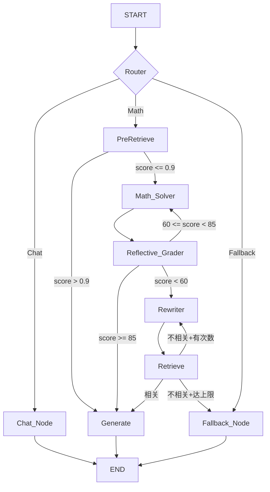

### 高等代数 Agentic RAG 系统构建方案

**背景**：传统 RAG 采用 `retrieve-then-read` 直线流程，存在三个结构性问题：(1) 无意图识别，闲聊问题也触发检索，浪费算力；(2) 无自我评估，模型直接输出错误答案也无纠错机制；(3) 无检索策略，单一 query 无法应对多概念联合检索需求。

**解决方案**：在 RAG 系统之上引入 LangGraph 有向图编排，将 RAG 降级为 Agent 的工具之一，叠加三层智能——路由、自评、循环纠错。基座模型使用 Qwen3-1.7B 验证架构有效性。

---

#### 第一阶段：有向图编排与状态传递

**技术栈**：LangGraph (StateGraph), MemorySaver。

**状态定义**：AgentState 继承 TypedDict，LangGraph 在节点间传递同一字典，每个节点 return 的 dict 通过 StateGraph 自动 **merge update** 到全局状态，而非覆盖。

```python
class AgentState(TypedDict):
    question: str                          # 用户原始问题
    route: Literal["Chat", "Math", "Fallback"]
    rewritten_query: NotRequired[str]
    keyword_groups: NotRequired[List[str]] # 分布式检索关键词组
    strategy: NotRequired[str]             # "multi" | "single"
    documents: NotRequired[List[str]]
    rerank_scores: NotRequired[List[float]]
    is_relevant: NotRequired[bool]         # 硬件阈值过滤结果
    internal_draft: NotRequired[str]       # Math_Solver 草稿
    score: int                             # 0-100 评分
    critique: NotRequired[str]
    self_refine_count: int                 # Self-Refine 已执行次数
    loop_count: int                        # RAG 重试次数
    generation_source: NotRequired[str]
    logic_path: NotRequired[str]
    answer: NotRequired[str]
```

**节点拓扑**：共 9 个节点，4 类条件边：

```
入口 → Router
  ├── Chat → Chat_Node → END
  └── Math → PreRetrieve(快速预检)
        ├── score > 0.9 → Generate(RAG直接生成) → END
        └── score ≤ 0.9 → Math_Solver → Reflective_Grader
              ├── fast_track(≥85) → Generate → END
              ├── self_refine(60~85) → Math_Solver(含critique) → Grader(循环)
              └── rag(<60) → Rewriter → Retrieve
                    ├── 相关 → Generate → END
                    ├── 不相关+有次数 → Rewriter(重试)
                    └── 不相关+达上限 → Fallback → END
```

---

#### 第二阶段：节点实现

##### 2.1 RouterNode — 二元意图分流

**职责**：最高维度分类，仅做 Chat/Math 二元分流。

**策略**：调用 Qwen3-1.7B，system prompt 含 10 个 Few-shot 示例，`max_tokens=50`（只生成一个词），`temperature=0.1`（确定性）。输出解析：匹配 `\bCHAT\b` 则 Chat，其余全部走 Math。

**设计选择**：v2.1 曾有三元路径（Chat/Math/Math_RAG），实验发现小模型做"是否需要检索"的元判断准确率低。v2.2 改为统一走 Math，将"是否检索"下沉到 Reflective_Grader 的评分区间。

v2.3在v2.2的基础上增加了PreRetrieve，使得能够在书中找到的原文的query，直接回答。

##### 2.2 MathSolverNode — 直接求解

**职责**：不检索的前提下让模型直接尝试解答。

**两种模式**：
- **首次求解**：调 Qwen3，要求分步推理 + LaTeX + `\boxed{}`。后处理去除 `<think>` 思维链标签。
- **Self-Refine 修正**：将原问题 + 旧回答 + 纠错意见三者拼入 user message，用独立 `self_refine_prompt` 修正。修正失败时保底返回原草稿。

##### 2.3 ReflectiveGraderNode — 三段式评分

**职责**：对 Math_Solver 的草稿进行 0-100 评分，是自适应流程的核心判据。

**评分三区间**（默认阈值）：

| 区间 | 分数 | 分流路径 |
|------|------|----------|
| Fast-Track | ≥ 85 | 直接输出草稿 |
| Self-Refine | 60 ~ 84 | 携带 critique 返回 Math_Solver 修正 |
| RAG | < 60 | 进入检索流程 |

**实现**：Few-shot Prompt 含 5 个评分示例覆盖满分到严重不足的完整谱系。输出强制 JSON `{"score": int, "critique": str, "reasoning": str}`。LLM 调用失败时返回 `{"score": 0}` 强制进入 RAG。

##### 2.4 QueryRewriterNode — 阶梯式查询重写

**职责**：当 Grader 判定需要查教材时，将用户问题转化为检索关键词，同时判断检索策略。

**阶梯式重写**：
- **tier=0 (Precise)**：精确提取定理名/编号/术语，输出 strategy 字段指导后续检索模式。
- **tier=1 (Expand)**：基于第一轮检索不足的反馈，执行全域降级扩展或靶向精准补漏。
- **tier≥2**：回退使用原始问题。

**鲁棒 JSON 解析（四层防御）**：

1. `json.loads()` 直接解析
2. 正则提取 ` ```json ` 代码块
3. 栈式括号匹配，逐段尝试
4. 转义修复后重试

失败时 `fallback_to_original=true`，直接用原始问题检索。

##### 2.5 PreRetrieve — 快速预检（v2.3 新增）

**动机**：路由判定为 Math 后，部分问题可以直接通过 RAG 回答，无需经过 Math_Solver → Grader 的 LLM 调用链。预检机制节省算力并加速响应。

**策略**：用原问题直接检索 top-20 → Rerank top-3 → 取最高 score。`threshold=0.9`（configurable）：

- **score > 0.9**：认为检索结果高度相关，直接走 RAG 生成路径，设置 `generation_source = "pre_retrieve_rag"`。
- **score ≤ 0.9**：认为检索结果不足以直接回答，进入现有 Agent 流程（Math_Solver → Grader → ...）。

**实现**：在 Router 条件边的 "Math" 出口后插入 `pre_retrieve` 节点，条件边二选一进入 `generate` 或 `math_solver`。

##### 2.6 Retrieve_Node — 双轨检索

**职责**：根据 strategy 走不同检索模式，使用 Rerank score 硬阈值替代 LLM Grade_Relevance。

**模式 A: Multi-Recall**（多概念对比问题）：

```
对每组关键词 → top-20 检索 → Rerank top-3
  Top-1 进主结果池
  Top-2/3 进候选池
候选池 → 用原始 question 二次重排 → 取 Top-1 补充
截断 ≤ 5 个文档
```

**模式 B: Single-Recall**（单概念深挖问题）：

```
query = keyword_groups[0] → top-20 检索 → Rerank top-3
Top-1 → 上下文感知扩展（前向/后向）
结果 = [扩展后的 Top-1] + Top-2/3
```

**上下文感知扩展**：根据 Top-1 文档的类型决定扩展方向。定理/定义/命题 → 前向加载后续块直到触碰边界；证明 → 后向加载前置块直到触碰父级边界。通过 Qdrant `retrieve(ids=[id + offset])` 实现。

**硬件级相关性过滤**：`top_score >= relevance_threshold(0.3)` 决定是否相关。分数来自 Rerank API，不经过 LLM。

##### 2.7 Generate_Node / Chat_Node / Fallback_Node

**Generate_Node**：`generation_source` 为 fast_track / self_refined 时直接输出草稿，否则用 documents 作为 context 调 Generator RAG 生成。

**Chat_Node**：无 context 调 Generator。

**Fallback_Node**：输出预设消息 `"在教材中未找到准确定义，建议换个问法"`，不走 LLM。

---

#### 第三阶段：循环控制与异常保护

| 保护机制 | 上限 | 触发行为 |
|----------|------|----------|
| RAG 重试 | max_loop_count=2 | 不相关时重写关键词重新检索，达上限进 Fallback |
| Self-Refine | self_refine_max=2 | 评分在 60-84 区间但已达上限，降级到 RAG |
| Early Stop | early_stop_threshold=5 | 修正后分数提升 < 5 视为无改善，提前跳出 |
| JSON 解析失败 | — | fallback_to_original 用原始问题 |
| LLM 调用异常 | — | 各节点独立 try-catch + 默认值降级 |

---

#### 第四阶段：评估结果

**注**：下述指标基于 v2.2 版本测得，v2.3 新增 PreRetrieve 预检节点，评估正在进行中。

**测试集构造**：
- 测试集 A：60 条常规 QA，含单定义、多定义对比、长证明/求解
- 测试集 B：25 条长证明，平均 answer 2000+ 字符

**裁判模型**：DeepSeek-chat + GLM-4 双裁判，从 correctness、faithfulness、answer_relevance、context_relevance 四个维度打分（0/1/2）。

**Agent vs RAG-only 对比（测试集 A, 60 条）**：
> 注:实际有效50条,在测试过程中,由于本地硬件问题,导致某些case被跳过

| 系统             | correctness<br>avg ≥1%   | faithfulness<br>avg ≥1% | answer_relevance<br>avg ≥1% | context_relevance<br>avg ≥1%
| :---             | :---:         | :---:        | :---:            | :---             
|original          | 1.22   74%    | -            | 1.84  97%        | -
|Agent(Fast-Track) |1.08    75%    |  -           | 1.75  95.8%      | -
|RAG-only          | 1.63   92%    | 1.49  87%    | 1.9  100%        | 1.85  100%
|Agent(RAG)        | 1.64   93.4%  | 1.61  90.8%  | 1.95  100%       | 1.92  100%

Agent Fast-Track 正确率低于original,但是占比略高。Agent RAG 路径指标高于 RAG-only。

**路径分布（测试集 A）**：

v2.2
```
Fast-Track: 35 条 (58.3%)
RAG:        21 条 (35.0%)  — loop=0: 20, loop=1: 1
Fallback:    4 条 ( 6.7%)
```

v2.3
```
Fast-Track: 12 条 (24%)
RAG:        38 条 (76%)  — loop=0: 38, loop=1: 0, loop=2:0
Fallback:    0 条 ( 0%)
```

约 24% 的问题可通过 Fast-Track 直接回答，无需检索。\
v2.2 Fast-Track占比58.3%（无PreRetrieve），v2.3降至24%（有PreRetrieve），说明PreRetrieve有效拦截了可以在书上直接找到的内容。

**Agent vs RAG-only 对比（测试集 B, 25 条）**：
> 注:实际有效24条,在测试过程中,由于本地硬件问题,导致某些case被跳过
> 注:该测试集为压力测试,模型表现有限

| 系统             | correctness<br>avg ≥1%   | faithfulness<br>avg ≥1% | answer_relevance<br>avg ≥1% | context_relevance<br>avg ≥1%
| :---             | :---:         | :---:        | :---:            | :---             
|original          | 0.46   43.8%    | -            | 1.46  83.3%        |  -
|v2.3(Fast-Track) | 0.25    12.5%   |  -           | 1.63  100%      | -
|RAG-only          | 0.73   58.3%    | 0.75  52.1%    | 1.71  91.7%        | 1.53  91.7%
|v2.3(RAG)        | 0.65   57.5%    | 0.7  45%  | 1.65  90%       | 1.45  95%
---

**路径分布（测试集 B）**：

```
Fast-Track: 4 条 (16.7%)
RAG:        20 条 (83.3%)  — loop=0: 15, loop=1: 5, loop=2:0
Fallback:    0 条 ( 0%)
```
约 16.7% 的问题可通过 Fast-Track 直接回答，无需检索。

#### 第五阶段：结果分析
- 5.1 在常规情况下,框架整体增益显著
  - 关于回答正确性:Agent RAG路径correctness达1.64，与RAG-only(1.63)持平，均显著优于裸模型(1.22)。
  - 测试集A中:Agent RAG路径在correctness、faithfulness、context_relevance上均优于RAG-only，证明Agent闭环（Grader评分+上下文聚合）对生成质量有正向作用。

- 5.2 Fast-Track路径效果有限
  - Fast-Track correcteness (1.08) 低于裸模型 (1.22)，分析原因：
    - 1.7B模型自反能力弱，"生成→评分→重写"流程中，模型难以基于自身反馈有效修正
    - Fast-Track意图识别可能将部分需检索的问题误判为简单问题

- 5.3 在测试集A中,Fast-Track触发条数相较v2.2下滑(58.3%->24%)
  - v2.3新增PreRetrieve节点后，部分原走Fast-Track的问题因检索置信度>0.9被拦截，转入RAG直接生成路径。这解释了Fast-Track占比从v2.2的58.3%下降至v2.3的24%。

#### 第六阶段：结论、已知局限与优化方向

**核心结论**：
v2.3验证了"Agent闭环可提升RAG生成质量"的核心假设（测试集A：Agent RAG correctness 1.64 vs RAG-only 1.63），但暴露了小模型自反能力的瓶颈（Fast-Track correctness 1.08 < 裸模型 1.22）。

**已知局限**：
1. 小模型自反能力弱：Fast-Track路径效果低于裸模型，Self-Refine触发率极低
2. 长证明Agent RAG表现下滑：测试集B中Agent RAG(0.65) < RAG-only(0.73)，推测系上下文遗忘与检索噪声
3. 分布式检索在复杂问题中可能引入噪声：检索到问题本身而非解答

**优化方向**：
1. 引入外部Grader模型，解耦生成与评估
2. 在3B/7B模型上验证扩展性
3. 数据库升级：加入"定理-证明"双向索引


#### 配置说明

```yaml
generator:
  n_ctx: 32768  # 最大上下文窗口
  max_tokens: 16384
agent:
  max_loop_count: 2              # RAG 重试上限
  self_refine_max: 2             # Self-Refine 轮次上限
  early_stop_threshold: 5        # 提升 < 5 分提前跳出
  pre_retrieve_threshold: 0.9    # 快速预检阈值（v2.3）
  fallback_message: "在教材中未找到准确定义，建议换个问法"
  router:
    default_path: "Math"
  rewriter:
    fallback_to_original: true
  reflective_grader:
    pass_threshold: 85
    rag_threshold: 60
```

**集成组件**（复用底层 RAG 系统）：

| 组件 | 实现 | 用途 |
|------|------|------|
| BlockAggregator.base_retriever | Qdrant + BGE-M3 hybrid search, top_k=20 | 基础检索 |
| Reranker | SiliconFlow API, BGE-Reranker-V2-M3 | 重排取 top-3 |
| BlockAggregator.q_client | QdrantClient | block_id 滚动查询 |
| Generator | Qwen3 via llama.cpp (OpenAI 接口) | 答案生成 |

---

#### 部署说明

1. **启动 Qdrant**：`docker run -d -p 6333:6333 -p 6334:6334 -v "${PWD}/qdrant_storage:/qdrant/storage:z" --name MathRAG qdrant/qdrant`
2. **启动 llm.cpp server**：`docker run -d -p 8080:8080 ...` 
- 生产环境建议采用vLLM替代llama.cpp以实现并发批处理，本地验证阶段使用llama.cpp以适配8GB显存约束。
> python -m vllm.entrypoints.openai.api_server --model {model_path} --host 0.0.0.0 --port 8000 --served-model-name {model_name} --max-model-len 32768 --max-num-seqs 3 --gpu-memory-utilization 0.8 --dtype bfloat16
3. **配置 API Key**：在 `configs/config.yaml` 或 `.env` 中配置 SiliconFlow API Key（Reranker）和 DeepSeek/GLM API Key（评测裁判）

```python
from src.agent import create_agent

agent = create_agent()
result = agent.run("证明定理10：λ-矩阵的初等因子唯一性")
print(result["answer"])
```


