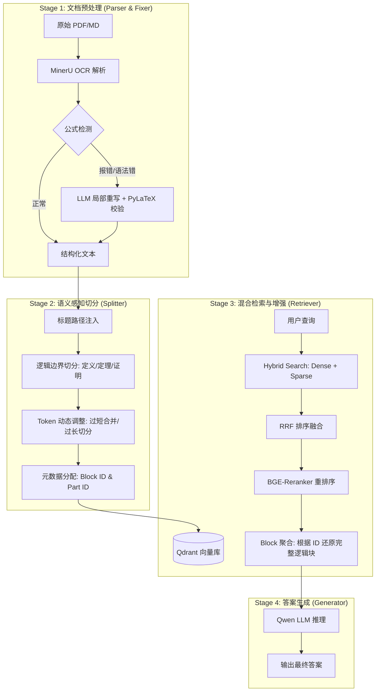

### 高等代数 RAG 系统构建方案

**背景**：数学教材 RAG 面临两大结构性瓶颈：
1. **OCR 质量差**：MinerU 识别的 Markdown 存在数学符号错乱、LaTeX 语法错误、括号失衡、跨页公式断裂等问题，直接索引入库会严重污染检索质量。
2. **语义断裂**：固定长度切分会切断"定理-证明"或"题目-详解"的完整语义链；若在公式处切分，甚至会导致公式环境破碎、渲染失败。

**解决方案**：构建"修复 → 语义切分 → 混合检索 → Block 聚合"的全链路 RAG 系统，基座模型使用 Qwen3-1.7B 验证架构有效性。

---

#### 第一阶段：源文档预处理与公式修复

**技术栈**：正则扫描 + LLM 局部重写 + PyLaTeX 编译校验。

**策略**：严格规则发现 + 上下文聚合 + 靶向修复。

1. **发现机制（宁错杀不放过）**：
   - `$$...$$` 块交由 PyLaTeX 渲染，报错即提取。
   - 检测 `\left| ... \right|` 或 `\begin{array}` 内部非法出现的 `\hline`。
   - 检测易错模式：`\text{行/列}` 嵌套错误、上下标错位 `[a-z][1-9]`、`\overline`、`\textcircled`。
   - 括号平衡性校验。

2. **上下文聚合**：
   - 若公式块 `$$...$$` 附近（如紧邻的下一行）出现 `$` 或公式片段，将两者**合并标记**为一个待修复单元 `[TARGET]`，避免切碎公式环境。

3. **修复执行**：
   - 基于 Few-shot 示例（约 21 条规则），调用 LLM 仅对标记的 `[TARGET]` 局部片段进行修正。
   - 修复后再次经 PyLaTeX 编译校验，确保入库公式均可渲染。

---

#### 第二阶段：语义感知的文本切分

**技术栈**：LlamaIndex, BGE-M3, Qdrant。

**核心目标**：将教材切分为**语义完整**且**长度可控**的 Chunk，保留层级结构作为上下文。

**切分流线**：

1. **结构路径注入**：
   - 识别"第X章 - X.X - X.X.X - 一、"四级标题。
   - 将标题路径写入 Chunk 文本开头作为显式上下文（如：`[第7章 > 7.1 > 7.1.1 一、定义]`）。

2. **初始切分（L1 规则边界）**：
   - 按关键词边界切分：`定义|定理|证明|命题|推论|引理|例|解|解法一`。
   - 逻辑断点处理：针对"证明"、"解"这类长段落，若**连续三行**不包含任何数学符号（`$`, `$$`, `\[`, `\begin` 等），判定为纯文字过渡段，于此处断开，标记为 `type: transition`。

3. **Token 动态调整**：
   - **过短合并**：Token < 200 的 Chunk，尝试向上合并，若合并后 > 600 则放弃合并。
   - **过长切分（L2 语义切分）**：Token > 600 的 Chunk（常见于长证明），按逻辑连接词切分（如 `\n由于`, `\n因此`, `\n所以`）。切分起点设置最小字符阈值，避免过度碎片化导致语义稀疏。

4. **元数据 ID 分配**：
   - `block_id`：相同的"证明"或"解"过程内，切分后的多块共享一个 Block ID。
   - `part_id`：Block 内部按顺序编号（Part 1, Part 2...）。
   - `id`：最终入库的唯一索引。

**Chunk 示例**：
```json
{
    "id": "4",
    "metadata": {
        "path": "第7章 一元和 $\\pmb{n}$ 元多项式环 > 7.1 一元多项式环 > 7.1.1 内容精华 > 一、 一元多项式的概念和运算",
        "type": "定义",
        "is_logic_block": false,
        "chapter": "7",
        "is_math_heavy": true,
        "block_id": "group_0",
        "part_id": "1/2"
    },
    "text": "",
    "token_count": 786
}
```

---

#### 第三阶段：混合检索与重排序策略

**Baseline 设定**：
- **Baseline_Dense**：纯 Dense 向量检索，固定大小切分（chunk_size=512, overlap=50）。
- **Baseline_Hybrid**：混合向量检索，固定大小切分（chunk_size=512, overlap=50）。

**Advance 方案**：

1. **混合检索**：
   - **Dense Vector**：BGE-M3 稠密向量。
   - **Sparse Vector**：BGE-M3 稀疏向量。
   - **融合**：RRF (Reciprocal Rank Fusion) 取 Top-K。

2. **重排序**：
   - **模型**：BGE-Reranker-V2-M3（训练长度 1024 Token）。
   - **约束**：单次输入需严格控制在 1024 Token 以内以保证效果。
   - **策略**：以当前 Chunk 作为 rerank 评分单元。

3. **Block 聚合（上下文恢复）**：
   - Rerank 得到 Top-3 后，检查各 Chunk 是否携带 `block_id`。
   - 若存在 `block_id`，将同 Block 下的所有 Part 聚合为完整逻辑块，作为最终上下文输入生成模型。

---

#### 第四阶段：评估体系与测试集构造

**裁判模型**：GLM-4 + DeepSeek-V3，双裁判从 correctness、faithfulness、answer_relevance、context_relevance 四个维度打分（0/1/2），减少模型间评分偏差。

**测试集构造**：
- **测试集 A（常规 QA）**：60 条，涵盖单定义、多定义对比、长短题解/证明。
  - 40 条单一 Query（定理证明、习题求解、定理/定义内容）
  - 14 条对比 Query（章节内定义对比）
  - 6 条多概念联合 Query
- **测试集 B（长证明压力测试）**：25 条，平均 answer 2000+ 字符，用于验证 Block 聚合对跨页语义恢复的有效性。

---

#### 第五阶段：评估结果

> **注**：下述检索指标基于 v0.1 核心逻辑版本测得。目前 v1.0 重构版已跑通全流程 Pipeline，由于 LLM-Judgement 运行成本及时间限制，全量测试集的新版本指标正在更新中，但核心性能趋势已验证一致。

**1. 检索性能对比（测试集 A）**

| 系统 | MAP@5 | MRR@5 | Recall@5 | MAP@10 | MRR@10 | Recall@10 | MAP@20 | MRR@20 | Recall@20 |
|:---|:---|:---|:---|:---|:---|:---|:---|:---|:---|
| Baseline (Dense) | 0.4006 | 0.5144 | 0.5042 | 0.4224 | 0.5324 | 0.6164 | 0.4358 | 0.5365 | 0.7178 |
| Baseline (Hybrid) | 0.3382 | 0.4781 | 0.4292 | 0.3567 | 0.4855 | 0.5172 | 0.3677 | 0.4916 | 0.6428 |
| **MathRAG (Hybrid)** | **0.4486** | **0.5375** | **0.5556** | **0.4722** | **0.5577** | **0.7250** | **0.4817** | **0.5646** | **0.8250** |

**2. Rerank 增益（Top-20 召回 + Rerank Top-3）**

| 系统 | MAP | MRR | Recall |
|:---|:---|:---|:---|
| Baseline (Dense) Raw@20 | 0.4358 | 0.5365 | 0.7178 |
| Baseline (Dense) Rerank@3 | 0.4521 | 0.6028 | 0.5236 |
| Baseline (Hybrid) Raw@20 | 0.3677 | 0.4916 | 0.6428 |
| Baseline (Hybrid) Rerank@3 | 0.4641 | 0.6222 | 0.5236 |
| MathRAG (Hybrid) Raw@20 | 0.4817 | 0.5646 | 0.8250 |
| **MathRAG (Hybrid) Rerank@3** | **0.6125** | **0.7083** | **0.7194** |

**3. 生成质量对比（测试集 A，Top-20 + Rerank Top-3）**

| 系统 | correctness | faithfulness | answer_relevance | context_relevance | correct≥1% | faith≥1% | rel≥1% | ctx_rel≥1% |
|:---|:---|:---|:---|:---|:---|:---|:---|:---|
| No-RAG | 1.20 | 0 | 1.88 | 0 | 46.5% | 0 | 58% | 0 |
| Baseline (Hybrid, no fix) | 1.47 | 1.13 | 1.98 | 1.68 | 52% | 40% | 60% | 58% |
| Baseline (Dense) | 1.43 | 1.22 | 1.93 | 1.72 | 51% | 43% | 59% | 59.5% |
| Baseline (Hybrid) | 1.43 | 1.23 | 1.93 | 1.66 | 50% | 43% | 60% | 58% |
| **MathRAG (Hybrid)** | **1.58** | **1.43** | **1.97** | **1.79** | **54.5%** | **47.5%** | **60%** | **59.5%** |

**4. 长证明压力测试（测试集 B，24 条有效）**

| 系统 | correctness | faithfulness | answer_relevance | context_relevance | correct≥1% | faith≥1% |
|:---|:---|:---|:---|:---|:---|:---|
| No-Fix | 0.65 | 0.88 | 1.88 | 1.50 | 14.5% | 13% |
| Baseline (Hybrid) | 0.44 | 0.52 | 1.73 | 1.31 | 10.5% | 9.5% |
| MathRAG | 0.48 | 0.65 | 1.83 | 1.48 | 11.5% | 10% |
| **MathRAG + BlockGet** | **0.77** | **1.00** | **1.75** | **1.46** | **13%** | **14.5%** |

---

#### 第六阶段：结果分析

**6.1 语义切分与 Block 聚合显著提升检索质量**
- MathRAG 在 MAP@20、MRR@20、Recall@20 上全面超越 Baseline。
- Rerank 后 MRR@20 从 0.492（Baseline Hybrid）提升至 **0.708**，增幅 44.1%。
- 长证明压力测试中，**BlockGet 机制使 correctness 从 0.48 提升至 0.77**，证明"定理-证明"级上下文聚合有效解决了跨页语义断裂。

**6.2 公式修复对检索的增益存在反直觉现象**
- 在测试集 A 中，**未修复文本（No-Fix）的检索效果在某些维度上优于修复后文本**。
- 根因假设：Embedding 模型（BGE-M3）更依赖"语义 Token 分布"而非"结构正确性"。修复后的 LaTeX 虽然语法标准，但引入大量对 Embedding 无效甚至有干扰的结构 Token；而未修复文本在一定程度上保留了核心变量和语义词，同时减少了结构冗余，形成了一种"弱压缩表示"。
- **后续验证方向**：测试 Embedding 模型对语义密度的敏感性，优化修复流程（如修复后精简冗余结构 Token）。

**6.3 混合检索 + Rerank 的工程有效性**
- Hybrid（Dense + Sparse）相比纯 Dense，在 Rerank 后 MRR 提升更显著（0.6028 vs 0.6222 vs 0.7083），证明 Sparse 向量对数学符号和术语的精确匹配有补充价值。
- Rerank 后 Recall 下降（0.8250 → 0.7194）符合预期：Rerank 通过精排过滤低质量召回，以牺牲部分 Recall 换取更高的 Top-K 准确率。

---

#### 第七阶段：结论、已知局限与优化方向

**核心结论**：
本系统验证了"语义感知切分 + Block 聚合 + 混合检索"在数学教材场景下的有效性。Rerank 后 MRR@20 达 0.708，长证明 correctness 凭借 BlockGet 提升 60%+。

**已知局限**：
1. **公式修复与 Embedding 的耦合矛盾**：修复后标准 LaTeX 可能降低 Embedding 语义密度，需验证并优化。
2. **切分规则依赖人工设计**：L2 语义切分基于逻辑连接词规则，对非标准教材的泛化能力有限。
3. **定理-证明单向索引**：当前仅支持从定理检索到证明，反向索引未建立。

**优化方向**：
1. **Embedding 感知修复**：在公式修复后增加"语义精简"步骤，移除对 Embedding 无贡献的结构冗余。
2. **LLM-based 上下文感知切分**：调研用轻量模型替代规则切分，提升泛化性。
3. **双向索引构建**：实现"定理 ↔ 证明"的 Block ID 双向关联，强化逻辑链完整性。

---

#### 部署说明

**向量数据库**：
```bash
docker run -d -p 6333:6333 -p 6334:6334 \
  -v "${PWD}/qdrant_storage:/qdrant/storage:z" \
  --name MathRAG qdrant/qdrant
```

**配置与模型**：
- 仔细阅读 `configs/config.yaml` 中的注释，API Key 支持 `.env` 文件或直接写入配置。
- 当前默认生成模型为 Qwen3-1.7B（本地 llama.cpp 部署），推荐使用 Qwen2.5-7B/14B 或 DeepSeek-V3 以获得更佳生成体验。

**测试**：
- 当前 LLM-Judgement 仅支持 GLM-4 和 DeepSeek（OpenAI 格式），字段配置请参考 `configs/config.yaml`。

---

